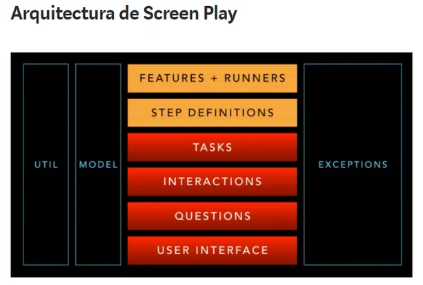

<h1 align="center"> SERENITY </h1>

**Cómo ejecutar pruebas en paralelo en Cucumber con Serenity: **
- https://serenity-bdd.github.io/docs/tutorials/running_cucumber_scenarios_in_parallel#step-3-create-a-junit-platformproperties-file
1. Crear un junit-platform.propertiesarchivo #
Crea un nuevo archivo con el nombre junit-platform.propertiesde tu src/test/resourcescarpeta. Este archivo habilita y configura la ejecución paralela.
Añade el siguiente contenido al archivo:
cucumber.execution.parallel.enabled=true
cucumber.execution.parallel.config.strategy=dynamic
cucumber.plugin=io.cucumber.core.plugin.SerenityReporterParallel
2. Crear un cucumber.propertiesarchivo #
Cree un nuevo archivo con el nombre cucumber.propertiesde su src/test/resourcescarpeta. Este archivo contendrá las opciones de Cucumber para sus pruebas de Cucumber.
Añade el siguiente contenido al archivo:
cucumber.execution.order = random
cucumber.plugin=pretty,json:target/cucumber.json,timeline:target/test-results/timeline
cucumber.snippet-type=camelcase

Serenity no solo informa sobre qué requisitos se probaron, sino también sobre cómo se probaron. Incluye detalles paso a paso de cómo se desarrolló una prueba, incluidas capturas de pantalla opcionales, para que sus pruebas documenten realmente lo que hace su aplicación.
Pero Serenity no se limita a la elaboración de informes. El objetivo subyacente de Serenity es facilitar la redacción rápida de criterios de aceptación automatizados, bien estructurados y fáciles de mantener, utilizando su biblioteca de pruebas convencional o BDD favorita.

<h2>Implementación de bibliotecas de pasos simples </h2>
La TravellerEarningStatusPointsclase es lo que llamamos una biblioteca de pasos. Usamos la @Stepsclase como se muestra arriba para indicar una biblioteca de pasos en nuestro código de prueba: esta anotación le indica a Serenity que cree una instancia e instrumente este campo, de modo que los métodos que llame en esta biblioteca también aparezcan en los informes de prueba.

Las bibliotecas de pasos contienen las tareas o acciones empresariales que un usuario realiza durante una prueba. Hay muchas formas de organizar las bibliotecas de pasos, pero una forma conveniente es agrupar los métodos en segmentos de comportamiento empresarial para un tipo de usuario determinado. En este caso, un viajero que está ganando puntos de estatus.

Tenga en cuenta que no fue necesario crear una instancia explícita de la clase Steps TravellerEarningStatusPoints. Cuando anotó una variable miembro de esta clase con la @Stepsanotación, Serenity BDD la instanciará automáticamente.

Nunca debe crear instancias de bibliotecas de pasos utilizando la newpalabra clave, ya que Serenity no podrá instrumentar la biblioteca de pasos correctamente y los métodos llamados no aparecerán en los informes.

**anotación @Managed**
En una prueba JUnit de Serenity, podemos usar la anotación @Managed para administrar el ciclo de vida de WebDriver. Una vez que tenemos un controlador disponible, podemos asignarlo a un actor mediante la BrowseTheWebclase de la siguiente manera:

**anotación  @CastMember**
Si solo necesitamos usar un actor que pueda interactuar con un sitio web usando Selenium, podemos usar la anotación @CastMember. Esta anotación configurará un actor con una instancia de WebDriver y administrará el ciclo de vida del navegador por nosotros (por lo que no es necesaria la @Managedanotación o WebDriverla variable). Puedes ver un ejemplo de esta anotación en acción aquí:

**Actores en Cucumber**
Configurar actores en Cucumber es un poco más complicado que en JUnit, porque generalmente nos referimos a ellos por su nombre en los escenarios de Cucumber. 

